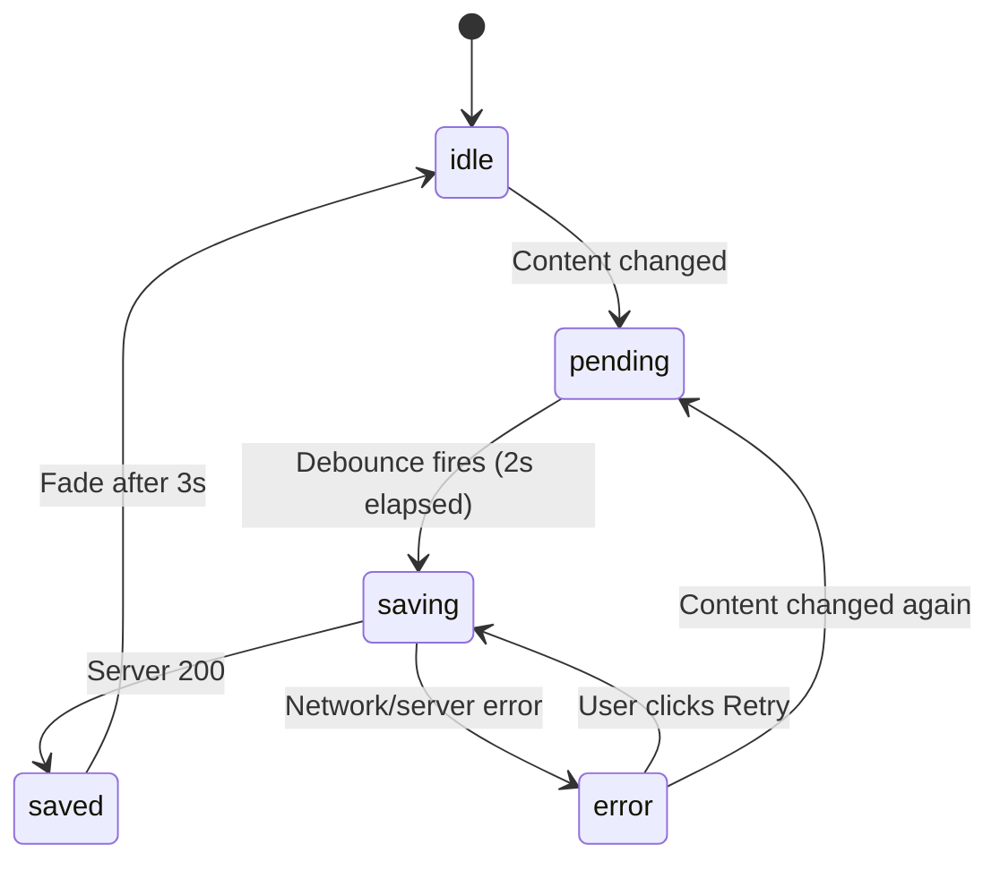

# Architecture

## Folder structure

```
Blog-Editor/
├── backend/
│   ├── app/
│   │   ├── __init__.py
│   │   ├── main.py              # FastAPI app, CORS, router registration
│   │   ├── database.py          # Motor client + MongoDB connection
│   │   ├── models/
│   │   │   └── post.py          # Pydantic models (create, update, response, list)
│   │   ├── routes/
│   │   │   ├── posts.py         # CRUD endpoints for blog posts
│   │   │   └── ai.py            # POST /api/ai/generate — streaming endpoint
│   │   └── services/
│   │       └── ai_service.py    # DeepSeek API client + streaming generator
│   ├── requirements.txt
│   ├── .env / .env.example
│   └── venv/
│
├── frontend/
│   ├── src/
│   │   ├── api/
│   │   │   ├── posts.js         # fetch wrappers for /api/posts/*
│   │   │   └── ai.js            # placeholder (streaming lives in useAIStream)
│   │   ├── features/
│   │   │   ├── editor/
│   │   │   │   ├── components/
│   │   │   │   │   ├── BlogEditor.jsx    # main editor shell + Lexical composer
│   │   │   │   │   ├── EditorToolbar.jsx # floating selection toolbar
│   │   │   │   │   ├── SaveIndicator.jsx # auto-save status display
│   │   │   │   │   └── AIPanel.jsx       # AI action buttons
│   │   │   │   └── hooks/
│   │   │   │       ├── useEditorSync.js  # syncs Lexical state → Zustand
│   │   │   │       └── useAutoSave.js    # debounced save logic
│   │   │   └── ai/
│   │   │       ├── components/
│   │   │       │   └── AIStreamOutput.jsx # streaming text display
│   │   │       └── hooks/
│   │   │           └── useAIStream.js     # fetch + ReadableStream consumer
│   │   ├── store/
│   │   │   └── useEditorStore.js          # Zustand global state
│   │   ├── lib/
│   │   │   └── debounce.js                # closure-based debounce utility
│   │   ├── App.jsx
│   │   ├── App.css              # component styles (toolbar, save, AI)
│   │   └── index.css            # design tokens, editor content styles
│   ├── package.json
│   └── vite.config.js
│
├── README.md
├── ARCHITECTURE.md
├── PRD.md
└── INSTRUCTIONS.md
```

---

## Why FastAPI

| Requirement | FastAPI feature |
|---|---|
| Streaming AI responses | `StreamingResponse` wraps any async generator natively |
| Async MongoDB calls | Motor is async — no thread-pool hacks needed |
| Auto-generated API docs | `/docs` gives us Swagger out of the box |
| Pydantic validation | Request/response models with type checking for free |

FastAPI is streaming-native. The AI endpoint yields tokens from DeepSeek as they arrive, and `StreamingResponse` pushes each chunk to the client with zero buffering. There's no need for WebSockets or SSE libraries — a plain `text/event-stream` response handles it.

---

## Why MongoDB over SQLite

Lexical's editor state is a recursive JSON tree:

```json
{
  "root": {
    "children": [
      {
        "type": "paragraph",
        "children": [
          { "type": "text", "text": "Hello", "format": 1 }
        ]
      }
    ]
  }
}
```

**SQLite** would require either:
1. `JSON.stringify()` → store as TEXT → lose queryability
2. Normalise into `nodes`, `children`, `formatting` tables → massive complexity for a document editor

**MongoDB** stores this as a **native BSON document**. The `lexical_state` field is a Python `dict` all the way through — no serialisation layer. The driver (Motor) reads and writes it as-is.

This also means if we later need to query posts by content structure (e.g. "find posts with an H1 containing 'Architecture'"), MongoDB can index into the nested JSON without schema changes.

---

## Why feature-based folder structure

```
# ✗ layer-based (groups by type)
components/
  BlogEditor.jsx
  EditorToolbar.jsx
  AIStreamOutput.jsx
hooks/
  useAutoSave.js
  useAIStream.js

# ✓ feature-based (groups by domain)
features/
  editor/
    components/BlogEditor.jsx
    hooks/useAutoSave.js
  ai/
    components/AIStreamOutput.jsx
    hooks/useAIStream.js
```

Feature-based grouping keeps related files together. When working on AI streaming, everything you need is in `features/ai/`. When working on the editor, everything is in `features/editor/`. This scales better than layer-based grouping, where adding a feature means touching 4-5 different directories.

---

## Zustand store design

The store (`useEditorStore.js`) has **4 slices**, each handling a separate concern:

```
┌────────────────────────────────────────────────────┐
│                  useEditorStore                     │
├─────────────┬───────────┬───────────┬──────────────┤
│ Active Post │ Post List │   Save    │     AI       │
├─────────────┼───────────┼───────────┼──────────────┤
│ activePostId│ posts[]   │ saveStatus│ aiOutput     │
│ title       │ loading   │           │ aiLoading    │
│ lexicalState│           │           │ aiAction     │
│ plainText   │           │           │              │
└─────────────┴───────────┴───────────┴──────────────┘
```

**Why separate slices, not separate stores:**

- Components subscribe to specific slices via selectors (`useEditorStore(s => s.saveStatus)`), so a save-status re-render doesn't touch the editor.
- But they're in **one store** (not four) because actions sometimes cross slices — e.g. `resetEditor()` clears the active post, save status, and AI state in one call.
- No async logic in the store. All async work (fetching, saving, streaming) lives in hooks. The store is pure state + setters.

---

## The Lexical JSON decision

### Problem

When the user types in a rich-text editor and refreshes the page, the content needs to survive. There are two approaches:

1. **Store HTML** — call `editor.getEditorState().read(() => $generateHtmlFromNodes(...))` and save the HTML string
2. **Store Lexical JSON** — call `editorState.toJSON()` and save the native state object

### Why we store JSON, not HTML

HTML is a **lossy** serialisation of Lexical state. Lexical nodes carry internal metadata (selection anchors, formatting bit flags, custom node properties) that HTML cannot represent. If you save HTML and reload:

- Selection state is lost
- Custom node types degrade to `<div>` / `<span>`
- Round-tripping through `$generateHtmlFromNodes → $generateNodesFromDOM` introduces subtle formatting bugs

Storing the JSON tree means the editor state is **byte-for-byte identical** on reload. We call `editor.setEditorState(editor.parseEditorState(json))` and the document appears exactly as the user left it — cursor position is the only thing lost.

The trade-off: the JSON is larger than equivalent HTML (typically 2-3×), and it's Lexical-specific (not portable to another editor). For a blog editor where fidelity matters more than portability, this is the right call.

---

## Auto-save state machine



The `pending` state is set **synchronously** when the editor fires `onChange`. This is deliberate — the user should see "unsaved changes" the instant they type, not after the 2-second debounce delay. The debounce only delays the actual network request.

---

## Trade-offs: what we'd add with more time

| Feature | Why it matters | Rough effort |
|---------|----------------|-------------|
| **JWT authentication** | Currently anyone can read/edit any post | 2-3 days |
| **Image upload** | Blog posts without images feel incomplete | 1-2 days (S3 + Lexical image node) |
| **Optimistic UI** | Save indicator shows "Saving..." during network latency — could feel slow | 0.5 days |
| **Post list sidebar** | Currently no sidebar — one post at a time | 1 day |
| **Versioning / undo** | No undo beyond Lexical's in-memory undo stack | 2 days |
| **Rate limiting** | AI endpoint has no throttle | 0.5 days |
| **E2E tests** | Playwright tests for the full editor flow | 1-2 days |
