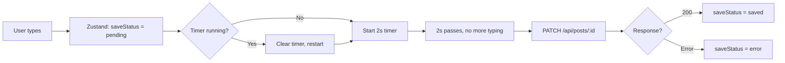

# INSTRUCTIONS.md — How to Build This Project

These instructions exist for one reason: the output of this project must feel like it was built by a thoughtful human developer, not generated by an AI. Every decision — code style, comments, documentation, UI — should pass the "did a real person write this?" test.

Read this fully before writing any code.

---

## The Most Important Rule

**If something looks perfect, it's probably wrong.**

Real developers:
- Don't write JSDoc on every single function
- Have slightly inconsistent comment verbosity
- Occasionally choose a slightly non-obvious variable name and then comment why
- Write a TODO comment and leave it there
- Have mild preferences (some functions get arrow syntax, some don't — there's a loose pattern but not a strict rule)

This project should look like the work of a skilled junior-to-mid developer who cares about their craft but hasn't been robotically uniform about it.

---

## Code Style Rules

### Comments

**DO:**
```js
// debounce timer ref — we clear this on every keystroke and only
// let it fire when the user actually pauses
const timer = useRef(null)
```

```js
// Lexical gives us a plain JS object here, not a string
// MongoDB stores it natively so no JSON.stringify needed
const state = editorState.toJSON()
```

```js
// TODO: might want to show a toast here instead of inline text
setError('Something went wrong, try again')
```

**DON'T:**
```js
/**
 * @function debounce
 * @param {Function} fn - The function to debounce
 * @param {number} delay - The delay in milliseconds
 * @returns {Function} The debounced function
 */
```

**Rule:** Comments explain *why*, occasionally *what* if it's genuinely non-obvious. Never explain things that the code itself already says clearly. Vary the density — some functions get a comment, some don't. That's normal.

### Naming

- Variables and functions: camelCase, descriptive but not verbose
- `handleSave` not `handleAutoSaveDebounceExecution`
- `post` not `blogPostDocument`
- Occasional short names in tight scope are fine: `e` for event, `p` for post in a `.map()`

### Function Style

Don't be uniform. A real developer has preferences that are mostly consistent but not perfectly so:

```js
// Arrow for simple transforms and callbacks
const getTitle = (post) => post.title || 'Untitled'

// Regular function for hooks and anything that needs hoisting clarity
function useAutoSave(postId) {
  // ...
}

// Both styles can appear in the same file — that's fine
```

### Error Handling

Handle errors, but don't over-engineer them. A real developer writes:

```js
try {
  await savePost(postId, content)
  setSaveStatus('saved')
} catch (err) {
  console.error('Auto-save failed:', err)
  setSaveStatus('error')
}
```

Not a custom error class hierarchy for a blog editor.

---

## UI Rules — Medium Editorial Style

This is the most critical section for passing the "not AI-generated" test.

### Typography

- **Heading font:** Lora (Google Fonts) — serif, editorial weight
- **Body font:** Source Serif 4 (Google Fonts) — readable, warm
- **UI font (labels, buttons, nav):** DM Sans — clean, modern, not Inter
- **Monospace:** JetBrains Mono — for any code blocks

```css
/* Import in index.css */
@import url('https://fonts.googleapis.com/css2?family=Lora:ital,wght@0,400;0,600;1,400&family=Source+Serif+4:opsz,wght@8..60,400;8..60,600&family=DM+Sans:wght@400;500&family=JetBrains+Mono&display=swap');
```

- Editor content: 20px, line-height 1.75, max-width 680px centered
- Headings: Lora, generous margin-top
- Never use Inter, Roboto, or Arial anywhere

### Color Palette

```css
:root {
  --bg: #faf9f7;           /* warm off-white, not pure white */
  --surface: #ffffff;
  --text-primary: #1a1a1a; /* near-black, not pure black */
  --text-secondary: #757575;
  --text-muted: #b0b0b0;
  --accent: #1a8917;       /* Medium's signature green */
  --border: #e8e8e8;
  --danger: #c0392b;
}
```

### What Medium Does That We Copy

- Toolbar is minimal — only appears when text is selected (floating toolbar)
- The editor surface has zero borders, zero background — it IS the page
- Post list sidebar is clean lines, no cards, no shadows
- "Publish" button is the only prominent CTA — everything else is subtle
- Status indicators are tiny, understated (small dot or muted text)
- Lots of vertical whitespace between elements

### What AI UIs Do That We Avoid

- No gradient backgrounds
- No `rounded-2xl` on everything
- No `shadow-lg` cards for simple list items
- No purple/blue accent colors
- No "glassmorphism" effects
- No hero sections with taglines in the editor UI
- No overly animated loading spinners — a simple opacity transition is enough

### Invoke Frontend-Design Skill

When building any visual component, always invoke the `frontend-design` skill first. The prompt should reference:
- The Medium editorial aesthetic
- The specific typography stack above
- The color palette variables
- The "human-crafted, not AI-generated" requirement

---

## Component Documentation

For each major component, create a short `.md` doc inside the component's folder. These are not formal specs — they're the kind of thing a developer would write in Notion to explain a component to a teammate.

### Required docs:

**`features/editor/EDITOR.md`**
- What BlogEditor.jsx does and why Lexical was chosen over other editors
- The flow from keystroke → Lexical state change → Zustand sync → auto-save
- ASCII or Mermaid diagram of this flow

**`features/editor/AUTOSAVE.md`**
- How the debounce is implemented (the actual logic, not just "we debounce it")
- Why 2 seconds was chosen
- The saveStatus state machine (idle → pending → saving → saved/error)
- Diagram of the state transitions

**`features/ai/AI.md`**
- How DeepSeek streaming works end-to-end
- Frontend: fetch → ReadableStream → render tokens
- Backend: FastAPI StreamingResponse
- Diagram of the request/response flow

**`ARCHITECTURE.md`** (root level, for the assignment submission)
- Why MongoDB over SQLite (Lexical JSON fits natively)
- Why FastAPI (async, perfect for streaming)
- Why feature-based folder structure
- The Zustand store design — what slices exist and why
- Trade-offs acknowledged honestly (a real developer admits trade-offs)

### Diagram style

Use Mermaid diagrams inside markdown. Keep them simple and functional — not overdesigned.

Example for auto-save flow:


---

## Zustand Store Design

The store should be clean, minimal, and purposeful. Each slice has a clear owner.

```js
// store/useEditorStore.js

const useEditorStore = create((set, get) => ({
  // --- Active post ---
  activePostId: null,
  activePostTitle: '',
  lexicalState: null,       // the raw JSON from editorState.toJSON()
  plainText: '',            // derived, used for AI prompts

  // --- Posts list ---
  posts: [],
  postsLoading: false,

  // --- Save status ---
  saveStatus: 'idle',       // 'idle' | 'pending' | 'saving' | 'saved' | 'error'

  // --- AI state ---
  aiOutput: '',
  aiLoading: false,
  aiAction: null,           // 'summarize' | 'fix_grammar' | null

  // --- Actions ---
  setActivePost: (post) => set({ ... }),
  updateContent: (lexicalState, plainText) => set({ ... }),
  setSaveStatus: (status) => set({ saveStatus: status }),
  setAIOutput: (text) => set({ aiOutput: text }),
}))
```

**Rules for the store:**
- No derived computations in the store — compute in components/hooks
- Actions are named as verbs: `setActivePost`, `updateContent`, `setSaveStatus`
- No async logic directly in the store — async lives in hooks
- No importing store into store

---

## Handwritten Debounce — Requirements

This is an evaluated component. The implementation must:

1. Live in `src/lib/debounce.js` as a standalone utility
2. Be written from scratch — no lodash, no underscore
3. Include a comment explaining the closure mechanism
4. Handle the case where the debounced function is called before the timer fires (clear + restart)
5. Be tested mentally: "if I type 10 characters rapidly then stop, does it save exactly once after 2 seconds?" — the answer must be yes

---

## Phase Gates

Before starting each phase, confirm the previous phase output is clean:

- **Phase 1 gate:** Editor renders, formatting works, Zustand store has correct shape
- **Phase 2 gate:** All endpoints return correct data, Lexical JSON round-trips without loss
- **Phase 3 gate:** Auto-save fires exactly once per pause, SaveIndicator shows all 4 states
- **Phase 4 gate:** Streaming works, tokens appear progressively, no full-page re-renders
- **Phase 5 gate:** UI passes the "real developer made this" test, README is complete

Do not proceed to the next phase until the gate passes. Discuss with the user at each gate.

---

## README.md Requirements

The README must read like a developer wrote it for other developers — not a product page.

Must include:
- Setup instructions (backend + frontend separately)
- How to add the DeepSeek API key
- **Auto-save logic explanation** (required by assignment) — explain the debounce, the timer, why 2 seconds
- **Database schema decision** — why MongoDB, why lexical_state as native JSON
- Known limitations / trade-offs (this shows maturity)
- Link to deployed frontend and backend

Tone: direct, technical, minimal marketing language. No "🚀 Features" sections.

---

## Final Checklist Before Submission

- [ ] Lexical JSON state saves and reloads without any data loss
- [ ] Debounce is handwritten and commented
- [ ] Zustand store has no redundant state
- [ ] UI uses Lora + Source Serif 4 + DM Sans (no Inter/Roboto anywhere)
- [ ] No gradient backgrounds anywhere
- [ ] No `shadow-lg` on list items
- [ ] AI streaming works and looks smooth in demo
- [ ] ARCHITECTURE.md exists and explains real trade-offs
- [ ] README explains auto-save and schema decisions (required by assignment)
- [ ] Both frontend and backend are deployed and accessible
- [ ] Demo video shows: typing → auto-save triggering → AI generating
