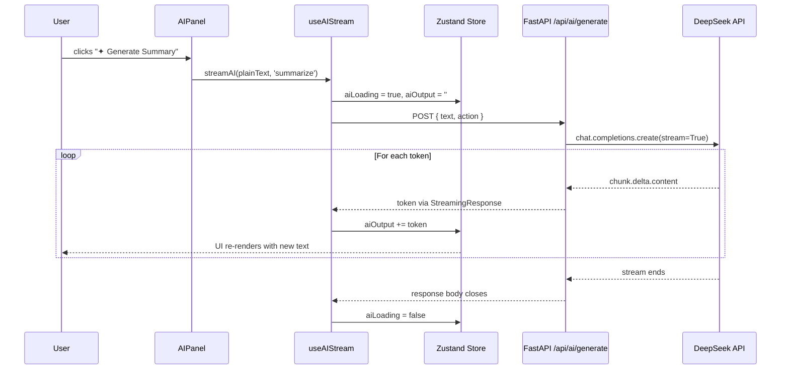

# AI module — streaming flow

## End-to-end flow



## Backend

### `ai_service.py`

- Creates an `AsyncOpenAI` client lazily (first call), pointed at `https://api.deepseek.com`
- `generate_stream(text, action)` is an **async generator** that yields text chunks
- Catches `AuthenticationError`, `APIError`, and generic exceptions — yields `[Error: ...]` messages so the frontend always gets a response instead of a hung connection

### `ai.py` (route)

- `POST /api/ai/generate` accepts `{ text, action }`
- Validates: empty text → 400, invalid action → 400
- Returns `StreamingResponse(generate_stream(...), media_type="text/event-stream")`
- Headers: `Cache-Control: no-cache`, `X-Accel-Buffering: no` (prevents nginx/proxy buffering)

## Frontend

### `useAIStream.js`

```
fetch → response.body.getReader() → while (!done) { reader.read() } → decode → append to store
```

Key details:
- Uses **native `fetch`**, not axios (axios doesn't expose `ReadableStream`)
- `TextDecoder` with `{ stream: true }` handles multi-byte chars split across chunks
- Each chunk is appended to `aiOutput` via `useEditorStore.getState().aiOutput` (reads outside React render to avoid stale closures)

### `AIStreamOutput.jsx`

- Shows the AI label + "streaming..." indicator during loading
- Renders `aiOutput` text progressively with a blinking cursor (CSS animation)
- After streaming completes, shows "Copy to clipboard" and "Insert into editor" buttons

### `AIPanel.jsx`

- Two buttons: "✦ Generate Summary" and "✦ Fix Grammar"
- Disabled when `aiLoading` is true or `plainText` is empty
- Passes the full `plainText` from Zustand to `streamAI`

### Insert into editor

When the user clicks "Insert into editor":

```js
editor.update(() => {
    const root = $getRoot()
    const paragraph = $createParagraphNode()
    paragraph.append($createTextNode(text))
    root.append(paragraph)
})
```

This creates a real Lexical paragraph node at the end of the document. It's not innerHTML injection — the editor's undo stack tracks it, and the next auto-save will persist the updated state.

## Supported actions

| Action | Prompt template |
|--------|----------------|
| `summarize` | "Summarize the following blog post concisely in 2-3 sentences: {text}" |
| `fix_grammar` | "Fix grammar and improve clarity of the following text. Return only the corrected text, no explanations: {text}" |
