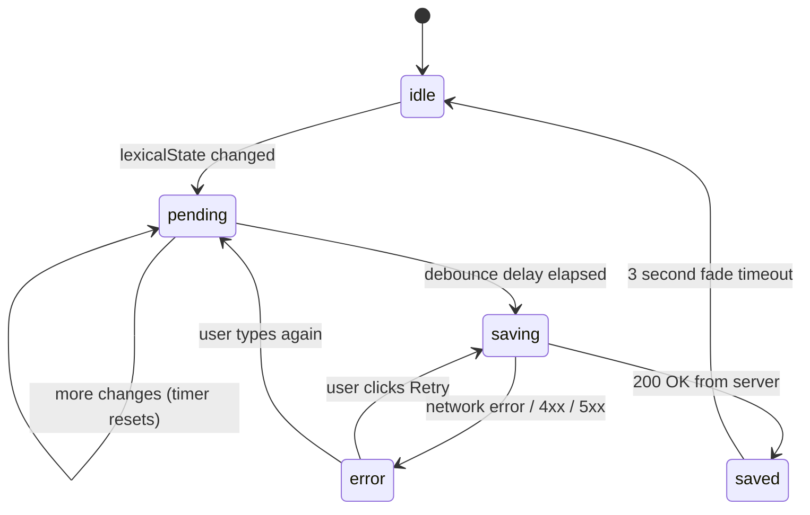
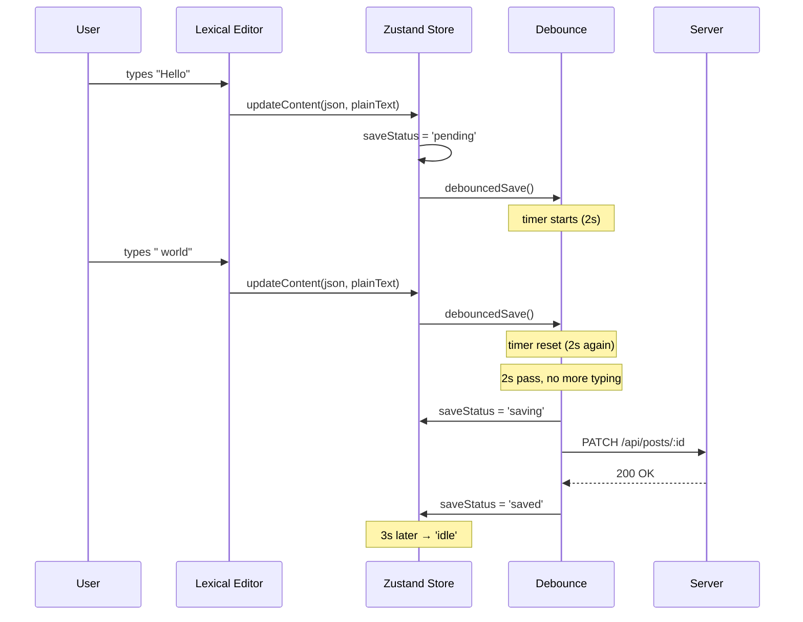

# Auto-save — debounce + state machine

## Overview

Auto-save has two files:
- `lib/debounce.js` — generic debounce utility (closure-based)
- `hooks/useAutoSave.js` — the save logic that uses debounce

## Debounce via closure

```js
export default function debounce(fn, delay) {
    let timer                      // ← closed over
    return (...args) => {
        clearTimeout(timer)
        timer = setTimeout(() => fn(...args), delay)
    }
}
```

The returned function and `fn` share a single `timer` variable through closure. Every invocation clears the previous timer and starts a new one. Only the **last** call within the `delay` window fires.

This is why we don't use a bare `setTimeout` — without the closure, each call would create an independent timer, and we'd get N saves instead of 1.

### Why 2 seconds

- **Too short (< 1s):** Most users are mid-sentence, triggering unnecessary saves
- **Too long (> 5s):** Risk losing content on tab close or crash
- **2 seconds:** User has stopped typing, safe to save. Matches Medium's auto-save cadence.

## State machine



### Why `pending` is set synchronously

```js
// Inside useAutoSave:
useEffect(() => {
    if (lexicalState !== prevRef.current) {
        setSaveStatus('pending')   // ← immediate, no debounce
        debouncedSave()            // ← fires after 2s
        prevRef.current = lexicalState
    }
}, [lexicalState])
```

The `pending` state is set the instant content changes — before the debounce timer starts. This guarantees the UI always shows "unsaved changes" while the user is typing. If we set `pending` inside the debounced function, there'd be a 2-second window where the user has unsaved changes but the UI shows nothing.

### Auto-create draft

If there's no `activePostId` in the store, the save function calls `POST /api/posts/` to create a new draft, stores the returned ID, then immediately PATCHes content to it. This means users never need to explicitly create a post — they just start typing.

## Sequence diagram


