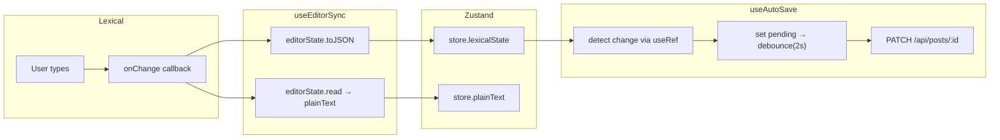

# Editor — Lexical integration

## Data flow



## Component hierarchy

```
<BlogEditor>
  ├── Title <input>
  └── <LexicalComposer>
        └── <EditorInner>
              ├── <RichTextPlugin>
              │     ├── contentEditable
              │     ├── placeholder
              │     └── ErrorBoundary
              ├── <HistoryPlugin>
              ├── <ListPlugin>
              ├── <EditorToolbar />       ← floating, selection-only
              ├── <SaveIndicator />       ← top-right, muted
              ├── <AIPanel />             ← below editor
              └── <AIStreamOutput />      ← below AI panel
```

## Why `EditorInner` exists

Lexical's `useLexicalComposerContext()` only works inside `<LexicalComposer>`. We need the editor instance for:
1. `useEditorSync` — registering the `onChange` listener
2. `useAutoSave` — reading current state
3. `handleInsert` — dispatching editor commands for AI insert

So we split into `BlogEditor` (outer shell, creates the composer) and `EditorInner` (inside the composer, has access to the editor).

## `EditorToolbar` — floating selection toolbar

The toolbar only appears when the user selects text. It uses `$getSelection()` on every Lexical update to check if there's a range selection. When there is, it reads the DOM's `getBoundingClientRect()` of the selection and positions a pill above it.

Format commands (`FORMAT_TEXT_COMMAND`, `FORMAT_ELEMENT_COMMAND`) are dispatched directly to the editor. The toolbar re-reads selection state after each command to toggle button highlights (bold pressed, italic pressed, etc.).
